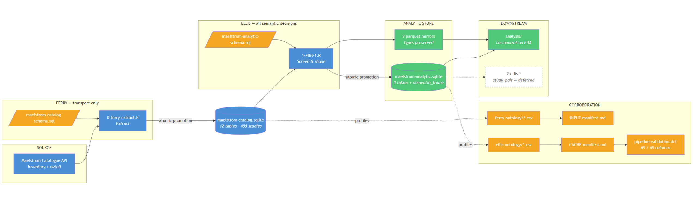

{width=100% fig-align="center" .lightbox}

## Welcome

This project builds a reproducible evidence base for identifying and investigating
harmonization opportunities across individual studies in the
[Maelstrom Research](https://www.maelstrom-research.org) catalogue.

The catalogue describes hundreds of cohort studies — their designs, populations,
geography, follow-up waves, data sources, biosamples, and annotated information
domains. That description is public, but it is not in a shape that lets anyone ask
which studies could plausibly be pooled. This project puts it in that shape, and does
so in a way that can be rebuilt from code and audited line by line.

The question driving the current pipeline is narrow and practical: **which longitudinal
studies could plausibly be harmonized to study dementia and cognitive decline, and on
what shared ground?** The pipeline answers the screening half of that question and
deliberately stops short of claiming that any two studies are actually harmonizable.
Study-level similarity is a discovery signal, not proof.

## What Is Here

- **[Project](project/mission.qmd)** — the mission, the methodology, and the shared
  vocabulary the work depends on.
- **[Pipeline](pipeline/pipeline-guide.qmd)** — how the data is acquired and shaped,
  plus the two manifests that describe what enters and what comes out.
- **[Primers](primers/data-primer-1.qmd)** — the canonical description of the analytic
  store: what each object is, what one row means, and where the metadata is thin.
- **[Site Map](site-map.qmd)** — an index of every page and where its content came from.

## How It Works

Two lanes, each with the same four-part anatomy: a version-controlled schema declaring
the physical contract, a script that builds into a temporary file, an atomic promotion,
and a self-profiling step that writes the evidence its manifest is required to quote.

The **Ferry** lane transports metadata and refuses to interpret it. It enumerates the
complete individual-study inventory from the public API, fetches one detail payload per
study, preserves that payload untouched as JSON, and unfolds the nested structure into
relational tables that follow the natural containment of the source model. The result is
a staging database of 12 tables, 124 columns, and 34,784 rows describing 455 individual
studies.

The **Ellis** lane makes the semantic decisions. It derives the analysis-ready
rectangles — 8 tables and 1 view, 224 columns, 17,193 rows — and makes exactly one
opinionated judgement: whether a study is relevant to dementia or cognitive decline.
That judgement is not a black box. A 37-term controlled lexicon is matched against named
source fields, and every match is retained as an evidence row, so any study's inclusion
or exclusion can be audited term by term. Of the 455 studies profiled, 155 enter the
dementia frame.

Nothing between the two lanes is hidden. The schema files declare the physical contract
before either script runs; a lane that produces a rectangle disagreeing with its schema
refuses to write it. Each lane profiles the database it delivered and rewrites the CSV
evidence behind its manifest, so the prose in the manifests is corroborated by the
artifact rather than asserted about it.

## Status

The pipeline is built and validated; the analytical work that consumes it is beginning.
Data Primer 1 is the first analytical artifact — a canonical, computed-at-render
description of the analytic store. Exploratory analyses will follow, and a second Ellis
lane measuring pairwise harmonization potential is the next milestone.
