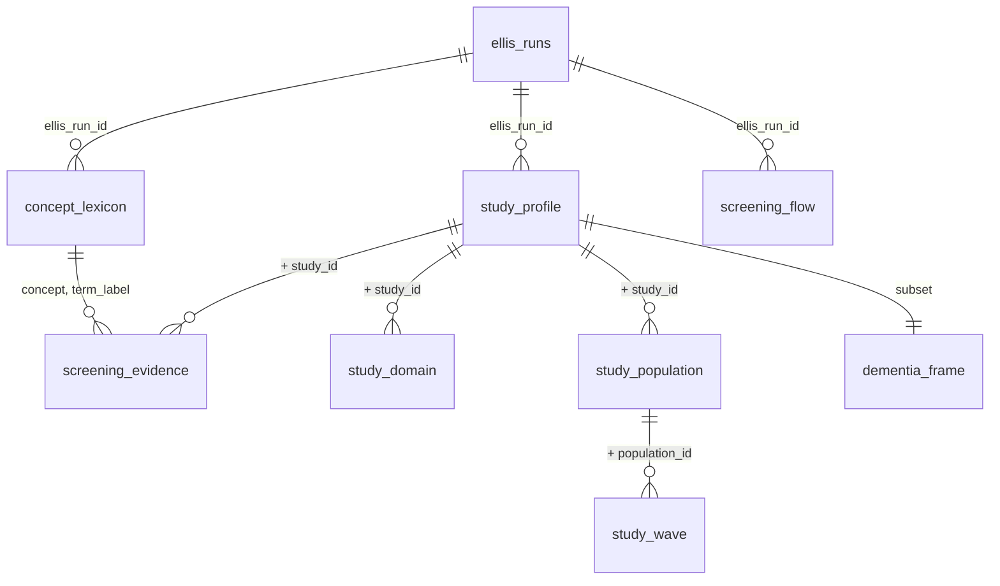

# CACHE Manifest — Maelstrom Harmonization Analytic Store

This document describes the analysis-ready rectangles produced by the Ellis lane
`manipulation/1-ellis-1.R`. It is the authoritative reference for downstream work in
`analysis/`.

> **Status**: Populated — profiled 2026-07-28 UTC from Ellis run
> `ellis-20260728T015434`, built on Ferry run `maelstrom-20260727T174615`.

## Output Summary

| Field | Value |
| --- | --- |
| Analytic database | `data-private/derived/maelstrom/maelstrom-analytic.sqlite` |
| Config key | `database.maelstrom_catalog.analytic` |
| Parquet mirrors | `data-private/derived/ellis/` |
| Ontology profiles | `data-public/metadata/ellis-ontology/` |
| Source | `data-private/derived/maelstrom/maelstrom-catalog.sqlite` |
| Database size | 4,222,976 bytes |
| SQLite version | 3.53.1 |
| Objects | 8 tables + 1 view |
| Columns (all objects) | 224 |
| Rows (tables only) | 17,192 |
| Studies profiled | 455 |
| Studies in the dementia frame | 155 |
| Lexicon terms | 37 |
| Screening evidence rows | 1,025 |

---

## What This Lane Is For

The question behind the pipeline is narrow and practical: **which longitudinal studies in
the Maelstrom catalogue could plausibly be harmonized to study dementia and cognitive
decline, and on what shared ground?**

The Ferry lane refuses to answer that question, correctly — it transports metadata and
stops. This Ellis lane answers it, and makes exactly one opinionated judgement in the
process: whether a study is relevant to dementia or cognitive decline. Everything else it
does is arithmetic over the Ferry tables.

Because that judgement is the only place the lane can be wrong, it is the place the lane
documents most heavily. Every textual signal that contributed to a relevance decision is
written to `screening_evidence` with the matched term, the field it was found in, and a
surrounding snippet. No study is called relevant here without a row a reader can check.

---

## How These Rectangles Were Produced

The lane is built from the inside out.

1. **Waves.** Each of the 6,482 data collection events becomes one row of `study_wave`,
   with its measurement sources pivoted from long terms into flags, its position in the
   study's and its population's wave sequence, and the gap in years since the prior wave.
2. **Populations.** Wave rows aggregate up into `study_population`: age eligibility,
   country coverage, recruitment vocabulary, and the follow-up window the waves imply.
3. **Studies.** Population rows aggregate up into `study_profile`, the spine — one row per
   study, 69 columns, joined to geography, declared research areas, and measurement-source
   coverage.
4. **Coverage.** `study_domain` crosses all 455 studies against all 18 Maelstrom research
   areas, producing a complete 8,190-row rectangle rather than a sparse list of annotations.
5. **Screening.** The lexicon runs over HTML-stripped free text, writing `screening_evidence`.
   Textual signals join the structured ones on the spine, the relevance score is computed,
   and `screening_flow` records the funnel.

The analytic database is rebuilt atomically. Writes go to a `.building` file and the
canonical path is replaced only after the transaction closes cleanly.

Governing documents:

- `manipulation/1-ellis-1.R` — the transformation and profiling lane
- `manipulation/maelstrom-analytic-schema.sql` — the physical table, key, view, and index contract
- `data-public/metadata/INPUT-manifest.md` — the Ferry staging database this lane consumes
- `manipulation/pipeline-project-spec.md` — the source, lane, output, and validation contract
- `manipulation/pipeline.md` — the architecture diagram and execution guide

---

## Corroboration Artifacts

Every number in this manifest is a **source observation**, not an invariant. The public
catalogue grows and the lexicon will be revised, so a later run will legitimately report
different values. The lane therefore regenerates machine-readable profiles each time it
completes, in `data-public/metadata/ellis-ontology/`:

| Artifact | Contents |
| --- | --- |
| `cache-provenance.csv` | Run identifiers, timestamps, database size, and profile totals |
| `cache-tables.csv` | Group, object type, grain, row count, column count, primary key |
| `cache-columns.csv` | Fill rate, distinct count, range, and example value per column |
| `cache-relationships.csv` | Observed cardinality and orphan counts per parent-child edge |
| `cache-vocabularies.csv` | Every distinct value of every controlled-vocabulary column |
| `cache-screening-flow.csv` | The screening funnel as delivered |

Diff `cache-tables.csv` and `cache-screening-flow.csv` after any run before assuming a
figure quoted below still holds.

---

## Object Ontology

### Seven Groups

| Group | Objects | Rows | Question It Answers |
| --- | --- | --- | --- |
| 1 — Run provenance | `ellis_runs` | 1 | When was this store built, from which Ferry run, and did it finish? |
| 2 — Screening apparatus | `concept_lexicon`, `screening_evidence`, `screening_flow` | 1,066 | What did the lane look for, what did it find, and who was excluded when? |
| 3 — Study spine | `study_profile` | 455 | What is each study, how deep is its follow-up, and how relevant is it? |
| 4 — Population layer | `study_population` | 998 | Who was enrolled, at what ages, from where? |
| 5 — Wave layer | `study_wave` | 6,482 | When was measurement taken, and with what instrument families? |
| 6 — Coverage matrix | `study_domain` | 8,190 | Which research areas does each study declare? |
| 7 — Analytic frame | `dementia_frame` | 155 | Which studies survive the screening funnel? |

`dementia_frame` is a **view**, not a table: `SELECT * FROM study_profile WHERE
flag_in_frame = 1`. It cannot drift from the spine it is drawn from.

### Containment Hierarchy



### Object Inventory

| Group | Object | Type | Grain | Rows | Columns | Primary Key |
| --- | --- | --- | --- | --- | --- | --- |
| 1 | `ellis_runs` | table | One row per Ellis run | 1 | 15 | `ellis_run_id` |
| 2 | `concept_lexicon` | table | One row per run, concept, and term | 37 | 7 | `ellis_run_id`, `concept`, `term_label` |
| 2 | `screening_evidence` | table | One row per run, study, concept, term, and field | 1,025 | 7 | `ellis_run_id`, `study_id`, `concept`, `term_label`, `source_field` |
| 2 | `screening_flow` | table | One row per run and screening step | 4 | 6 | `ellis_run_id`, `step` |
| 3 | `study_profile` | table | One row per run and study | 455 | 69 | `ellis_run_id`, `study_id` |
| 4 | `study_population` | table | One row per run, study, and population | 998 | 23 | `ellis_run_id`, `study_id`, `population_id` |
| 5 | `study_wave` | table | One row per run, study, population, and event | 6,482 | 22 | `ellis_run_id`, `study_id`, `population_id`, `dce_id` |
| 6 | `study_domain` | table | One row per run, study, and research area | 8,190 | 6 | `ellis_run_id`, `study_id`, `area_code` |
| 7 | `dementia_frame` | view | One row per run and in-frame study | 155 | 69 | Inherited from `study_profile` |

---

## Observed Relationships

Cardinalities are measured, not assumed. Source: `cache-relationships.csv`.

| Parent | Child | Join Keys | Children Per Parent (min / mean / max) | Parents Without Children | Orphan Rows |
| --- | --- | --- | --- | --- | --- |
| `study_profile` | `study_population` | `ellis_run_id`, `study_id` | 1 / 2.19 / 20 | 0 | 0 |
| `study_profile` | `study_domain` | `ellis_run_id`, `study_id` | 18 / 18 / 18 | 0 | 0 |
| `study_profile` | `screening_evidence` | `ellis_run_id`, `study_id` | 1 / 4.86 / 23 | 244 | 0 |
| `study_population` | `study_wave` | `+ population_id` | 1 / 6.49 / 83 | 0 | 0 |

No orphan rows exist anywhere. The 244 studies without evidence rows are the studies where
no lexicon term matched anywhere — a substantive finding, not a defect.

> **Warning — composite keys are mandatory.** As in the Ferry database, `population_id`
> takes only 39 distinct values across 998 rows and `dce_id` only 88 across 6,482. These
> are sequence labels local to their parent, not global keys. Any join must carry the full
> key path.

---

## The Screening Apparatus

### The Lexicon

Four concepts, ordered by how specific each is to the research question. Patterns are
matched against lowercased, HTML-stripped text. `concept_weight` is the contribution a
concept makes to `relevance_score` when **at least one** of its terms matches anywhere —
weight is per concept, not per hit, so a study that says "dementia" fourteen times is not
four times more relevant than one that says it once.

`ageing` carries weight 0 by design. Studying older adults is not the same as studying
cognition, so the signal is retained as description and excluded from the score.

| Concept | Weight | Terms | Patterns |
| --- | ---: | ---: | --- |
| `dementia` | 3 | 12 | `dementia`, `alzheimer`, `mild cognitive impairment`, `\bmci\b`, `cognitive impairment`, `cognitive declin`, `lewy bod`, `frontotemporal`, `neurodegenerat`, `amyloid`, `neurofibrillary`, `vascular cognitive` |
| `cognition` | 2 | 10 | `cogniti`, `neurocogniti`, `neuropsycholog`, `\bmemory\b`, `executive function`, `\bmmse\b`, `mini.mental`, `\bmoca\b`, `montreal cognitive assessment`, `processing speed` |
| `brain` | 1 | 8 | `hippocamp`, `white matter`, `neuroimag`, `brain mri`, `\bapoe\b`, `cerebrospinal`, `brain volume`, `brain health` |
| `ageing` | 0 | 7 | `\bage?ing\b`, `older adult`, `elderly`, `geriatric`, `longevity`, `senescen`, `late.life` |

The full table, with a per-concept rationale, is materialized in `concept_lexicon` and
stamped with the run that used it. Revising the lexicon therefore changes the stored
lexicon alongside the results it produced.

### Fields Scanned

Population and event text are collapsed to the study level before matching: the question
asked is whether the *study* is about cognition, not which wave mentioned it.

| Source Field | Origin | Evidence Rows |
| --- | --- | ---: |
| `event_text` | `data_collection_events.name_en` + `description_html_en` | 559 |
| `study_objectives` | `studies.objectives_html_en` | 309 |
| `study_name` | `studies.name_en` | 85 |
| `population_text` | `study_populations.name_en` + `description_html_en` | 38 |
| `study_follow_up_info` | `studies.follow_up_info_html_en` | 20 |
| `study_methods_info` | `studies.methods_info_html_en` | 14 |
| `study_acronym` | `studies.acronym_en` | 0 |

### The Score

`relevance_score` is additive and per-signal. Reading it backwards from the `sig_*` columns
of the same row must always reproduce it:

```text
relevance_score = 3 * sig_text_dementia
                + 2 * sig_text_cognition
                + 1 * sig_text_brain
                + 2 * sig_source_cognitive
                + 1 * sig_area_cognitive
```

Range 0–9. `sig_text_ageing` is deliberately absent from the formula.

| Score | Studies | Score | Studies |
| ---: | ---: | ---: | ---: |
| 0 | 225 | 5 | 40 |
| 1 | 31 | 6 | 5 |
| 2 | 27 | 7 | 37 |
| 3 | 13 | 8 | 29 |
| 4 | 45 | 9 | 3 |

### The Tiers

| Tier | Definition | Studies |
| --- | --- | ---: |
| `core` | Any `dementia` lexicon hit | 78 |
| `probable` | Not core, and `relevance_score >= 3` | 94 |
| `possible` | Not core or probable, and `relevance_score >= 1` | 58 |
| `unrelated` | `relevance_score == 0` | 225 |

`relevance_tier` is an ordered factor in the parquet mirror (`unrelated < possible <
probable < core`) and plain text in SQLite.

### The Funnel

Each step is applied to the survivors of the step before it, in the same order that
`frame_exclusion_reason` is assigned. Source: `screening_flow` and `cache-screening-flow.csv`.

| Step | Criterion | Definition | n Remaining | n Excluded |
| ---: | --- | --- | ---: | ---: |
| 0 | All individual studies in the Ferry run | One row per study in the completed Ferry extraction | 455 | — |
| 1 | Relevance tier is `probable` or `core` | `relevance_score >= 3` or any dementia lexicon hit | 172 | 283 |
| 2 | Longitudinal design | `n_waves >= 2` data collection events | 165 | 7 |
| 3 | Cognitive measurement evidence | `cognitive_measures` declared at an event, or a dementia lexicon hit | **155** | 10 |

Studies excluded at any step remain in `study_profile` with `flag_in_frame = 0` and a
populated `frame_exclusion_reason`, so sensitivity analysis over a different frame
definition needs no re-run.

> **Note — age is not a frame criterion.** Only 42% of studies report a population maximum
> age. Requiring an age boundary would have removed studies for missing metadata rather
> than for missing relevance. Later-life reach is exposed as `flag_older_adult_reach`
> instead: 94 of the 155 in-frame studies carry it, and the 61 that do not are largely
> birth and life-course cohorts whose cognitive measurement is real but early.

---

## `study_profile` — The Study Spine

455 rows, 69 columns, one per study. This is the validation target declared in
`manipulation/pipeline-validation.dcf`.

### Identity and Provenance

| Column | Type | Fill | Description |
| --- | --- | ---: | --- |
| `ellis_run_id` | TEXT | 1.00 | Ellis run identifier, `ellis-{YYYYMMDD}T{HHMMSS}` UTC |
| `ferry_run_id` | TEXT | 1.00 | Ferry run this store was built from |
| `study_id` | TEXT | 1.00 | Maelstrom slug, `3d` … `zulu` |
| `study_acronym` | TEXT | 1.00 | 451 distinct; four acronyms are shared by two studies each |
| `study_name` | TEXT | 1.00 | Full English study name |
| `study_page_url` | TEXT | 1.00 | Public catalogue page |
| `website_url` | TEXT | 0.76 | Study's own site |
| `inventory_rank` | INTEGER | 1.00 | Position in the name-sorted catalogue, 1–455 |

### Design

| Column | Type | Fill | Description |
| --- | --- | ---: | --- |
| `design_code` | TEXT | 1.00 | Source taxonomy term |
| `design_label` | TEXT | 1.00 | Readable label; ordered factor in parquet |
| `study_start_year` | INTEGER | 1.00 | 1920 – 2026 |
| `published` | INTEGER | 1.00 | Always 1; the inventory query returns published studies only |
| `marker_paper` | TEXT | 0.68 | Free-text citation |
| `pubmed_id` | TEXT | 0.60 | PubMed identifier |

### Enrolment Scale

| Column | Type | Fill | Description |
| --- | --- | ---: | --- |
| `n_populations` | INTEGER | 1.00 | 1 – 20 |
| `target_number` | INTEGER | 0.84 | Study-level target, 20 – 4,275,000 |
| `total_participants` | INTEGER | 0.83 | Sum of population participant counts; NA only when every population is NA |
| `total_samples` | INTEGER | 0.57 | Sum of population sample counts |

### Longitudinal Depth

| Column | Type | Fill | Description |
| --- | --- | ---: | --- |
| `n_waves` | INTEGER | 1.00 | Data collection events across all populations, 1 – 193 |
| `max_population_waves` | INTEGER | 1.00 | Largest wave count within a single population, 1 – 83 |
| `first_wave_year` | INTEGER | 1.00 | Earliest event start year, 1920 – 2026 |
| `last_wave_year` | INTEGER | 1.00 | Latest event start year, 1921 – 2032 |
| `follow_up_span_years` | INTEGER | 1.00 | `last_wave_year - first_wave_year`, 0 – 83 |
| `mean_wave_gap_years` | REAL | 0.82 | Mean within-population gap between consecutive waves, 0 – 67 |
| `n_planned_waves` | INTEGER | 1.00 | Events with a start year after the current calendar year, 0 – 26 |
| `flag_longitudinal` | INTEGER | 1.00 | `n_waves >= 2`; TRUE for 391 studies |
| `flag_repeated_within_population` | INTEGER | 1.00 | `max_population_waves >= 2`; stricter than `flag_longitudinal` |

> **Note — `flag_longitudinal` counts events, not repeated measurement of the same people.**
> A study with two populations measured once each satisfies it. Use
> `flag_repeated_within_population` when repeated measurement of the same cohort matters.

### Age Reach

| Column | Type | Fill | Description |
| --- | --- | ---: | --- |
| `min_population_min_age` | INTEGER | 0.70 | Youngest stated minimum age, 0 – 100 |
| `max_population_max_age` | INTEGER | 0.42 | Oldest stated maximum age, 1 – 105 |
| `flag_older_adult_reach` | INTEGER | 1.00 | Any population with minimum age ≥ 50 or maximum age ≥ 65; TRUE for 161 studies |

> **Warning — `flag_older_adult_reach` is FALSE when age is unstated.** It is claimed only
> from a stated boundary, never inferred. Absence of the flag is not evidence that a study
> excludes older adults.

### Geography

| Column | Type | Fill | Description |
| --- | --- | ---: | --- |
| `n_countries` | INTEGER | 1.00 | Distinct ISO codes across populations, 1 – 25 |
| `primary_country` | TEXT | 1.00 | Most frequent population country; ties by first appearance. 32 distinct |
| `countries` | TEXT | 1.00 | Pipe-delimited sorted ISO codes |
| `flag_multinational` | INTEGER | 1.00 | `n_countries > 1` |

### Access Terms

| Column | Type | Fill | Description |
| --- | --- | ---: | --- |
| `access_data` | TEXT | 0.99 | `yes` (415), `no` (33), `na` (3) |
| `access_biosamples` | TEXT | 0.98 | `no` (173), `na` (139), `yes` (136) |
| `access_other` | TEXT | 0.96 | `na` (390), `yes` (30), `no` (16) |
| `access_fees` | INTEGER | 0.86 | Source flag, carried unchanged |
| `access_restrictions` | INTEGER | 0.86 | Source flag, carried unchanged |
| `maelstrom_authorized` | INTEGER | 1.00 | Source flag, carried unchanged |

### Declared Research-Area Coverage

| Column | Type | Fill | Description |
| --- | --- | ---: | --- |
| `attribute_coverage_known` | INTEGER | 1.00 | Study carries at least one `Mlstr_area` annotation |
| `n_areas` | INTEGER | 1.00 | Count of declared areas, 0 – 17 |
| `has_area_cognitive_psychological` | INTEGER | 1.00 | Declares `Cognitive_psychological_measures` |
| `has_area_diseases` | INTEGER | 1.00 | Declares `Diseases` |
| `has_area_health_status` | INTEGER | 1.00 | Declares `Health_status_functional_limitations` |

> **Warning — read `has_area_*` only alongside `attribute_coverage_known`.** Just 201 of 455
> studies (44%) carry any `Mlstr_area` annotation, and 93 of the 155 in-frame studies carry
> none. For those studies `has_area_* = 0` means "not annotated", not "not measured".

### Measurement Sources Across Waves

| Column | Type | Fill | Description |
| --- | --- | ---: | --- |
| `n_events_cognitive` | INTEGER | 1.00 | Events declaring `cognitive_measures`, 0 – 72 |
| `prop_events_cognitive` | REAL | 1.00 | `n_events_cognitive / n_waves`, 0 – 1 |
| `has_source_cognitive_measures` | INTEGER | 1.00 | Any event declares `cognitive_measures` |
| `has_source_questionnaires` | INTEGER | 1.00 | Any event declares `questionnaires` |
| `has_source_physical_measures` | INTEGER | 1.00 | Any event declares `physical_measures` |
| `has_source_biological_samples` | INTEGER | 1.00 | Any event declares `biological_samples` |
| `has_source_administrative_databases` | INTEGER | 1.00 | Any event declares `administratives_databases` (source spelling) |
| `has_biosample_blood` | INTEGER | 1.00 | Any event collected `blood` |

### Screening Signals

| Column | Type | Fill | Description |
| --- | --- | ---: | --- |
| `n_dementia_hits` | INTEGER | 1.00 | Total `dementia` lexicon matches, 0 – 263 |
| `n_cognition_hits` | INTEGER | 1.00 | Total `cognition` lexicon matches, 0 – 328 |
| `n_brain_hits` | INTEGER | 1.00 | Total `brain` lexicon matches, 0 – 36 |
| `n_ageing_hits` | INTEGER | 1.00 | Total `ageing` lexicon matches, 0 – 66 |
| `sig_text_dementia` | INTEGER | 1.00 | `n_dementia_hits > 0`; weight 3 |
| `sig_text_cognition` | INTEGER | 1.00 | `n_cognition_hits > 0`; weight 2 |
| `sig_text_brain` | INTEGER | 1.00 | `n_brain_hits > 0`; weight 1 |
| `sig_text_ageing` | INTEGER | 1.00 | `n_ageing_hits > 0`; descriptive, weight 0 |
| `sig_area_cognitive` | INTEGER | 1.00 | Alias of `has_area_cognitive_psychological`; weight 1 |
| `sig_source_cognitive` | INTEGER | 1.00 | Alias of `has_source_cognitive_measures`; weight 2 |

### Relevance and Frame Membership

| Column | Type | Fill | Description |
| --- | --- | ---: | --- |
| `relevance_score` | REAL | 1.00 | Additive score, 0 – 9 |
| `relevance_tier` | TEXT | 1.00 | `unrelated` (225), `possible` (58), `probable` (94), `core` (78) |
| `flag_topic_relevant` | INTEGER | 1.00 | Tier is `probable` or `core`; step 1 of the funnel |
| `flag_cognitive_evidence` | INTEGER | 1.00 | `sig_source_cognitive` or `sig_text_dementia`; step 3 of the funnel |
| `flag_in_frame` | INTEGER | 1.00 | All three criteria hold; TRUE for 155 studies |
| `frame_exclusion_reason` | TEXT | 0.66 | First failing criterion; NA exactly when `flag_in_frame` is TRUE |

---

## `study_population` — The Population Layer

998 rows, 23 columns. One row per study and population.

| Field | Type | Fill | Description |
| --- | --- | ---: | --- |
| `ellis_run_id`, `study_id`, `population_id` | TEXT | 1.00 | Composite key |
| `population_order` | INTEGER | 1.00 | Source display order, 0 – 19 |
| `population_name` | TEXT | 1.00 | English population name |
| `participant_number` | INTEGER | 0.85 | Enrolled participants, 1 – 4,275,000 |
| `sample_number` | INTEGER | 0.53 | Biosamples, 0 – 486,019 |
| `minimum_age`, `maximum_age` | INTEGER | 0.66 / 0.37 | Stated age eligibility |
| `age_span_years` | INTEGER | 0.33 | `maximum_age - minimum_age` |
| `flag_newborn`, `flag_twins` | INTEGER | 1.00 | Source inclusion flags |
| `flag_older_adult_reach` | INTEGER | 1.00 | Minimum age ≥ 50 or maximum age ≥ 65 |
| `n_countries` | INTEGER | 1.00 | Distinct ISO codes, 0 – 25 |
| `primary_country` | TEXT | 1.00 | **First** country listed by the source for this population |
| `countries` | TEXT | 1.00 | Pipe-delimited sorted ISO codes |
| `recruitment_data_sources` | TEXT | 0.99 | Pipe-delimited `data_sources` terms |
| `recruitment_general` | TEXT | 0.48 | Pipe-delimited `general_population_sources` terms |
| `recruitment_specific` | TEXT | 0.46 | Pipe-delimited `specific_population_sources` terms |
| `n_waves` | INTEGER | 1.00 | Data collection events, 1 – 83 |
| `first_wave_year`, `last_wave_year` | INTEGER | 1.00 | Event start-year window |
| `follow_up_span_years` | INTEGER | 1.00 | 0 – 83 |

> **Note — two different `primary_country` rules.** At population level it is the *first*
> country the source lists. At study level it is the *most frequent* country across
> populations. The two are documented separately because neither generalizes to the other.

---

## `study_wave` — The Wave Layer

6,482 rows, 22 columns. One row per data collection event. This is the temporal spine and
the natural input to Gantt-style design plots.

| Field | Type | Fill | Description |
| --- | --- | ---: | --- |
| `ellis_run_id`, `study_id`, `population_id`, `dce_id` | TEXT | 1.00 | Composite key |
| `wave_name` | TEXT | 1.00 | English event name |
| `wave_order_study` | INTEGER | 1.00 | Rank by start year within the study, 1 – 193 |
| `wave_order_population` | INTEGER | 1.00 | Rank by start year within the population, 1 – 83 |
| `start_year` | INTEGER | 1.00 | 1920 – 2032 |
| `end_year` | INTEGER | 0.88 | 1922 – 2035 |
| `duration_years` | INTEGER | 0.88 | `end_year - start_year`, −1 – 68 |
| `years_since_first_wave` | INTEGER | 1.00 | Offset from the study's earliest wave, 0 – 83 |
| `gap_from_prior_wave_years` | INTEGER | 0.85 | Gap to the prior wave in the same population, 0 – 74; NA for first waves |
| `n_data_sources` | INTEGER | 1.00 | Distinct source terms at this event, 0 – 6 |
| `has_questionnaires` | INTEGER | 1.00 | Source flag |
| `has_cognitive_measures` | INTEGER | 1.00 | Source flag — the key harmonization signal |
| `has_physical_measures` | INTEGER | 1.00 | Source flag |
| `has_biological_samples` | INTEGER | 1.00 | Source flag |
| `has_administrative_databases` | INTEGER | 1.00 | Source flag |
| `has_other_sources` | INTEGER | 1.00 | Source flag |
| `n_biosamples` | INTEGER | 1.00 | Distinct biosample terms, 0 – 6 |
| `has_biosample_blood` | INTEGER | 1.00 | Blood collected at this event |
| `flag_planned_wave` | INTEGER | 1.00 | Start year later than the current calendar year |

> **Warning — `duration_years` reaches −1.** At least one source event declares an end year
> before its start year. The lane carries the arithmetic through rather than silently
> repairing it. Filter on `duration_years >= 0` when duration matters.

The year columns carry a second surprise worth stating plainly.

> **Note — future waves are real.** Start years run to 2032 and end years to 2035. These
> are planned or ongoing waves, not data errors. Use `flag_planned_wave` to censor at the
> extraction date if observed follow-up depth is what you need.

---

## `study_domain` — The Coverage Matrix

8,190 rows, 6 columns: 455 studies × 18 Maelstrom research areas, complete by construction.

| Field | Type | Fill | Description |
| --- | --- | ---: | --- |
| `ellis_run_id`, `study_id`, `area_code` | TEXT | 1.00 | Composite key |
| `area_label` | TEXT | 1.00 | `area_code` with underscores replaced and first letter capitalized |
| `has_area` | INTEGER | 1.00 | Study declares this `Mlstr_area` annotation |
| `attribute_coverage_known` | INTEGER | 1.00 | Study declares at least one area; constant within a study |

Area codes are read from the Ferry data rather than hardcoded, so a new Maelstrom research
area appears automatically as 455 new rows on the next run.

> **Warning — `has_area = 0` is ambiguous without `attribute_coverage_known`.** For the 254
> unannotated studies every area reads 0. A coverage heatmap that ignores this will show a
> false absence across more than half the catalogue.

---

## `screening_evidence` — The Audit Trail

1,025 rows, 7 columns. One row per study, concept, term, and source field where a lexicon
term matched.

| Field | Type | Fill | Description |
| --- | --- | ---: | --- |
| `ellis_run_id`, `study_id`, `concept`, `term_label`, `source_field` | TEXT | 1.00 | Composite key |
| `n_hits` | INTEGER | 1.00 | Occurrences of the term in that field |
| `first_snippet` | TEXT | 1.00 | Up to 60 characters of context on each side of the first match |

Concept distribution: `cognition` 484, `ageing` 267, `dementia` 237, `brain` 37.

To audit any relevance claim:

```sql
SELECT concept, term_label, source_field, n_hits, first_snippet
FROM screening_evidence
WHERE study_id = 'h-70'
ORDER BY concept, term_label;
```

---

## `concept_lexicon`, `screening_flow`, `ellis_runs`

`concept_lexicon` (37 rows) stores the exact patterns used by the run that produced these
results: `concept`, `concept_weight`, `term_label`, `pattern`, `match_mode`
(`substring` 31, `word` 6), and a per-concept `rationale`.

`screening_flow` (4 rows) stores the funnel reproduced above.

`ellis_runs` (1 row) records `ellis_run_id`, `ferry_run_id`, the Ferry run's status and
completion time, both database paths, lexicon size, `studies_in` (455), `studies_out`
(455), `studies_in_frame` (155), and `status = completed`.

---

## Known Limitations

These are properties of the method, not defects to be fixed silently.

1. **No negation handling.** "No evidence of cognitive impairment" scores identically to
   "incident cognitive impairment". `screening_evidence.first_snippet` exists so a human
   can catch this; 1,025 rows is a readable volume.
2. **The lexicon is English-only.** Studies whose Maelstrom metadata is authored in another
   language and left untranslated will under-score.
3. **Metadata, not instruments.** `has_cognitive_measures` records that a study declared a
   cognitive instrument family at an event. It does not say which instrument, and two
   studies flagged alike may share nothing harmonizable. The Maelstrom variable-level API
   would be required to go deeper, and it is out of the current Ferry scope.
4. **The frame is a screening result, not an eligibility decision.** 155 studies passed a
   deliberately permissive filter. Confirming any of them as harmonizable requires reading
   the study.
5. **Absent metadata never counts as evidence.** Every `flag_*` derived from an optional
   source field is FALSE when the field is missing. The counterpart is that FALSE cannot be
   read as a substantive negative.
6. **Birth cohorts sit inside the frame.** 61 of 155 in-frame studies lack later-life
   reach. Life-course cohorts with childhood cognitive measurement are genuinely relevant
   to cognitive-decline research, but they answer a different question than an ageing
   cohort. Split on `flag_older_adult_reach` before pooling.

---

## Usage Notes for Analysts

- Start from `dementia_frame` (or `dementia_frame.parquet`) for the screened set, and from
  `study_profile` when you need the excluded studies and their reasons.
- Always join on the full composite key path; `population_id` and `dce_id` are local labels.
- Filter to the current `ellis_run_id` even though only one run is present, so the query
  survives a future multi-run archive.
- **Representation differs by format.** SQLite has no boolean type: `flag_*`, `sig_*`,
  `has_*`, and `is_*` are 0/1 integers there, and `design_label` and `relevance_tier` are
  plain text. The parquet mirrors in `data-private/derived/ellis/` carry real logicals and
  ordered factors. Prefer parquet for analysis in R.
- `relevance_score` is reconstructible from the `sig_*` columns of the same row. If it is
  not, the row is corrupt — report it rather than working around it.
- Treat every count in this manifest as a dated observation. Re-run the lane and diff
  `cache-tables.csv` and `cache-screening-flow.csv` before assuming a prior figure holds.
- Maelstrom catalogue terms of use apply to any republication of study-level metadata.

---

## Rebuild

Run from the repository root, after the Ferry lane:

```powershell
Rscript ./manipulation/0-ferry-extract.R
Rscript ./manipulation/1-ellis-1.R
```

To rebuild into a scratch location without replacing the canonical store:

```powershell
Rscript ./manipulation/1-ellis-1.R `
  --target-db=./data-private/derived/maelstrom/test-maelstrom-analytic.sqlite `
  --parquet-dir=./data-private/derived/ellis-test/ `
  --ontology-dir=./data-private/derived/ellis-test-ontology/
```

The lane applies `manipulation/maelstrom-analytic-schema.sql` on every rebuild and refuses
to write a rectangle whose columns disagree with that contract, naming the difference in
both directions.
