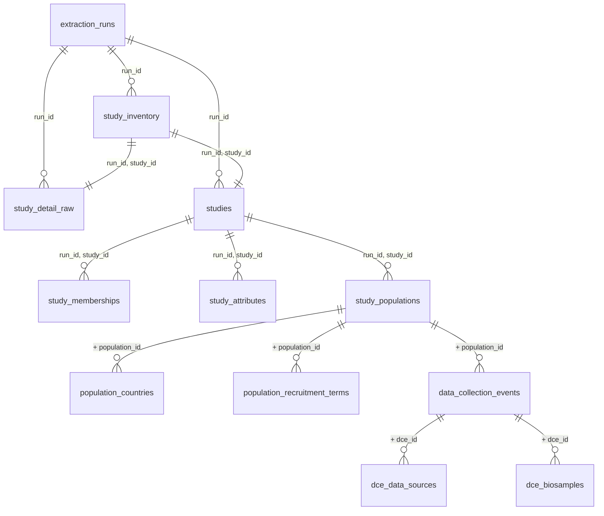

# INPUT Manifest — Maelstrom Catalogue Staging Database

This document describes the data that enters the pipeline: the staging SQLite database
produced by the Ferry lane `manipulation/0-ferry-extract.R`. It is the authoritative
description of what an Ellis lane may consume.

> **Status**: Populated — profiled 2026-07-28 UTC from Ferry run
> `maelstrom-20260727T174615` (completed 2026-07-27 17:47:32 UTC).

## Output Summary

| Field | Value |
| --- | --- |
| Source system | Maelstrom Research public catalogue API |
| Base URL | `https://www.maelstrom-research.org` |
| Staging database | `data-private/derived/maelstrom/maelstrom-catalog.sqlite` |
| Config key | `database.maelstrom_catalog.staging` |
| Database size | 33,464,320 bytes |
| SQLite version | 3.53.1 |
| Tables | 12 |
| Columns (all tables) | 124 |
| Rows (all tables) | 34,781 |
| Individual studies | 455 |
| Authentication | None; all endpoints are public |

---

## How These Tables Were Produced

The acquisition is deliberately shallow. Three ideas describe the whole Ferry lane.

1. **Enumerate.** One paginated RQL query against `/ws/studies/_rql` lists every record
   where `Mica_study.className = Study`, sorted by name, 50 records per page. Each returned
   summary becomes one row of `study_inventory`, stamped with its position in the sorted
   catalogue (`inventory_rank`) and the URL that produced it.
2. **Fetch.** For every study identifier in that inventory, one request to
   `/ws/study/{study_id}` retrieves the complete detail payload. The untouched payload is
   stored as JSON in `study_detail_raw`, so nothing observed at the source is ever lost.
3. **Unfold.** The nested JSON is flattened into relational tables that follow the natural
   containment of the source model: a study contains populations, a population contains data
   collection events, and an event lists the data sources and biosamples it produced. Each
   nesting level becomes a table; each repeated list of terms becomes a narrow child table.

Only technical normalization happens along the way: English localized strings are lifted
into convenient columns, API booleans become integer flags, and JSON containers are parsed.
No taxonomy is collapsed, no eligibility rule is applied, and no harmonization measure is
computed — those belong to a future Ellis lane.

The database is rebuilt atomically. Writes go to a `.building` file, and the canonical
database is replaced only after every write and the closing transaction succeed.

Governing documents:

- `manipulation/0-ferry-extract.R` — the extraction and profiling lane
- `manipulation/maelstrom-catalog-schema.sql` — the physical table, key, and index contract
- `manipulation/pipeline-project-spec.md` — the source, lane, output, and validation contract
- `manipulation/pipeline.md` — the architecture diagram and execution guide

---

## Corroboration Artifacts

Every number in this manifest is a **source observation**, not an invariant. The public
catalogue grows, so a later run will legitimately report different values. To keep the
document falsifiable, the Ferry lane regenerates a set of machine-readable profiles each
time it completes, in `data-public/metadata/ferry-ontology/`:

| Artifact | Contents |
| --- | --- |
| `ontology-provenance.csv` | Run identifier, timestamps, database size, and profile totals |
| `ontology-tables.csv` | Group, grain, row count, column count, and primary key per table |
| `ontology-columns.csv` | Fill rate, distinct count, range, and example value per column |
| `ontology-relationships.csv` | Observed cardinality and orphan counts per parent-child edge |
| `ontology-vocabularies.csv` | Every distinct value of every controlled-vocabulary column |

To re-derive the profiles from an existing database without contacting the API, run the
lane's function definitions and call the profiler directly:

```powershell
Rscript -e "src <- readLines('./manipulation/0-ferry-extract.R'); i <- grep('^# ---- execute-extraction', src)[1]; eval(parse(text = paste(src[seq_len(i - 1L)], collapse = '\n'))); profile_ontology()"
```

A bounded validation run (`--max-studies`) does not describe the catalogue and therefore
does not overwrite these artifacts unless `--ontology-dir` is passed explicitly.

---

## Table Ontology

### Six Groups

Twelve tables are more than a reader should hold at once. They resolve into six groups,
each answering one question. The group prefix is recorded in `ontology-tables.csv` as
`table_group`.

| Group | Tables | Rows | Question It Answers |
| --- | --- | --- | --- |
| 1 — Run provenance | `extraction_runs` | 1 | When was this database built, from where, and did it finish? |
| 2 — Raw payload | `study_inventory`, `study_detail_raw` | 910 | What did the API literally return? |
| 3 — Study core | `studies` | 455 | What is each study, and on what terms can its data be accessed? |
| 4 — Study context | `study_memberships`, `study_attributes` | 3,827 | Who runs the study, and what research areas does it claim? |
| 5 — Population layer | `study_populations`, `population_countries`, `population_recruitment_terms` | 4,176 | Who was enrolled, from where, and recruited how? |
| 6 — Event layer | `data_collection_events`, `dce_data_sources`, `dce_biosamples` | 25,412 | When was measurement taken, by what instrument, on what specimen? |

Groups 1 and 2 are provenance and are not intended for analysis. Groups 3 through 6 form
the analytical spine: they descend from the study, through its populations, to the
individual waves of data collection.

### Containment Hierarchy



### Table Inventory

| Group | Table | Grain | Rows | Columns | Primary Key |
| --- | --- | --- | --- | --- | --- |
| 1 | `extraction_runs` | One row per extraction run | 1 | 12 | `run_id` |
| 2 | `study_inventory` | One row per run and study | 455 | 13 | `run_id`, `study_id` |
| 2 | `study_detail_raw` | One row per run and study | 455 | 5 | `run_id`, `study_id` |
| 3 | `studies` | One row per run and study | 455 | 29 | `run_id`, `study_id` |
| 4 | `study_memberships` | One row per run, study, role, and person | 2,199 | 14 | None declared |
| 4 | `study_attributes` | One row per run, study, and annotation term | 1,628 | 4 | None declared |
| 5 | `study_populations` | One row per run, study, and population | 998 | 17 | `run_id`, `study_id`, `population_id` |
| 5 | `population_countries` | One row per population and country | 1,127 | 4 | None declared |
| 5 | `population_recruitment_terms` | One row per population and recruitment term | 2,051 | 5 | None declared |
| 6 | `data_collection_events` | One row per population and event | 6,482 | 11 | `run_id`, `study_id`, `population_id`, `dce_id` |
| 6 | `dce_data_sources` | One row per event and data-source term | 14,345 | 5 | None declared |
| 6 | `dce_biosamples` | One row per event and biosample term | 4,585 | 5 | None declared |

---

## Observed Relationships

Cardinalities below are measured, not assumed. Source: `ontology-relationships.csv`.

| Parent | Child | Join Keys | Children Per Parent (min / median / max) | Parents Without Children | Orphan Rows |
| --- | --- | --- | --- | --- | --- |
| `study_inventory` | `study_detail_raw` | `run_id`, `study_id` | 1 / 1 / 1 | 0 | 0 |
| `study_inventory` | `studies` | `run_id`, `study_id` | 1 / 1 / 1 | 0 | 0 |
| `studies` | `study_memberships` | `run_id`, `study_id` | 1 / 4 / 25 | 1 | 0 |
| `studies` | `study_attributes` | `run_id`, `study_id` | 1 / 8 / 17 | 254 | 0 |
| `studies` | `study_populations` | `run_id`, `study_id` | 1 / 1 / 20 | 0 | 0 |
| `study_populations` | `population_countries` | `+ population_id` | 1 / 1 / 25 | 4 | 0 |
| `study_populations` | `population_recruitment_terms` | `+ population_id` | 1 / 2 / 6 | 7 | 0 |
| `study_populations` | `data_collection_events` | `+ population_id` | 1 / 4 / 83 | 0 | 0 |
| `data_collection_events` | `dce_data_sources` | `+ dce_id` | 1 / 2 / 6 | 1 | 0 |
| `data_collection_events` | `dce_biosamples` | `+ dce_id` | 1 / 1 / 6 | 3,432 | 0 |

No orphan rows exist anywhere in the database: every child row resolves to a parent within
the same run.

> **Warning — composite keys are mandatory.** `population_id` takes only 39 distinct values
> across 998 rows, and `dce_id` only 88 distinct values across 6,482 rows. These identifiers
> are sequence labels local to their parent, not global keys. Any join must carry the full
> key path (`run_id`, `study_id`, `population_id`, `dce_id`); joining on `dce_id` alone will
> silently produce a Cartesian result.

---

## Group 1 — Run Provenance

`extraction_runs` records one row per rebuild. Because the database is replaced atomically,
exactly one run is present at any time; `run_id` nonetheless appears in every table so that
future multi-run archives remain possible without a schema change.

| Column | Description |
| --- | --- |
| `run_id` | Run identifier, `maelstrom-{YYYYMMDD}T{HHMMSS}` in UTC |
| `started_at_utc`, `completed_at_utc` | Run boundaries |
| `base_url`, `inventory_url` | Exact endpoints queried |
| `page_size`, `requested_max_studies` | Pagination and bounding arguments |
| `expected_total_studies` | `totalHits` reported by the API |
| `extracted_inventory_studies`, `extracted_detail_studies` | Rows actually written |
| `status` | `running` during the transaction; `completed` on success |

Observed: expected 455, extracted 455 inventory and 455 detail, `status = completed`.

## Group 2 — Raw Payload

`study_inventory` holds the summary as returned by the list endpoint, including
`inventory_rank` (catalogue position under name sort) and `summary_json`.
`study_detail_raw` holds `payload_json`, the complete unparsed detail response, plus the
`source_url` and `fetched_at_utc` that produced it.

These two tables make the rest of the database reconstructible. If a column is ever found
to be misparsed, the fix can be applied to stored JSON without re-contacting the API.

## Group 3 — Study Core

`studies` is the flattened detail payload: 29 columns, 455 rows, one per study.

| Column | Fill Rate | Distinct | Observed Range or Notes |
| --- | --- | --- | --- |
| `study_id` | 1.00 | 455 | Lowercase slugs, `3d` … `zulu` |
| `name_en`, `acronym_en` | 1.00 | 455 / 451 | Four acronyms are shared by two studies each |
| `published` | 1.00 | 1 | Always `1`; the inventory query returns published studies only |
| `design_code` | 1.00 | 7 | See vocabulary table below |
| `start_year` | 1.00 | 73 | 1920 – 2026 |
| `target_number` | 0.84 | 345 | 20 – 4,275,000 participants |
| `website_url` | 0.76 | 307 | — |
| `follow_up_info_html_en` | 0.93 | 404 | Free-text HTML |
| `methods_info_html_en` | 0.38 | 125 | Free-text HTML |
| `access_data` / `access_biosamples` / `access_other` | 0.99 / 0.98 / 0.96 | 3 each | `yes`, `no`, `na` |
| `access_fees`, `access_restrictions` | 0.86 | 2 | Integer flags |
| `maelstrom_authorized`, `specific_authorized` | 1.00 | 2 | Integer flags |
| `maelstrom_authorizer` | 0.44 | 184 | — |
| `maelstrom_authorization_date` | 0.34 | 60 | 1969-12-31 – 2026-04-25 |
| `specific_authorization_date` | 0.23 | 21 | 1969-12-31 – 2021-11-11 |
| `marker_paper` | 0.68 | 291 | Free-text citation |
| `pubmed_id` | 0.60 | 255 | — |
| `recruitment_target` | 1.00 | 6 | Pipe-collapsed list of `methods$recruitments` terms |
| `content_json` | 1.00 | 455 | Parsed detail content, retained verbatim |

> **Note:** `1969-12-31` in the authorization date columns is an epoch-zero sentinel, not a
> real date. An Ellis lane should convert it to missing.

## Group 4 — Study Context

`study_memberships` (2,199 rows) carries named people with their institution, city, and
country. `study_attributes` (1,628 rows) carries the Maelstrom research-area annotations.

> **Warning — annotation coverage is partial.** Only 201 of 455 studies (44%) carry any
> `Mlstr_area` attribute. A harmonization analysis that treats the absence of an attribute
> as the absence of the research area would misread more than half the catalogue.

## Group 5 — Population Layer

`study_populations` (998 rows, median 1 population per study, maximum 20) describes each
enrolled group.

| Column | Fill Rate | Observed Range |
| --- | --- | --- |
| `participant_number` | 0.85 | 1 – 4,275,000 |
| `sample_number` | 0.53 | 0 – 486,019 |
| `minimum_age` | 0.66 | 0 – 100 |
| `maximum_age` | 0.37 | 1 – 105 |
| `newborn`, `twins` | 1.00 | Integer flags; 61 and 10 populations flagged |
| `territory_html_en` | 0.85 | Free-text HTML |

`population_countries` (1,127 rows, 61 distinct ISO codes) and
`population_recruitment_terms` (2,051 rows) are the narrow companion tables.

## Group 6 — Event Layer

`data_collection_events` (6,482 rows) is the temporal spine — median 4 events per
population, maximum 83.

| Column | Fill Rate | Observed Range |
| --- | --- | --- |
| `start_year` | 1.00 | 1920 – 2032 |
| `end_year` | 0.88 | 1922 – 2035 |
| `description_html_en` | 1.00 | Free-text HTML |
| `other_data_sources_html_en` | 0.17 | Free-text HTML |

> **Note:** End years beyond the present (up to 2035) are planned or ongoing waves, not
> data errors. An Ellis lane computing observed follow-up depth must decide explicitly
> whether to censor at the extraction date.

`dce_data_sources` (14,345 rows) and `dce_biosamples` (4,585 rows) record which instrument
families and specimen types each event produced. 3,432 of 6,482 events list no biosample.

---

## Controlled Vocabularies

Full counts for every term are in `ontology-vocabularies.csv`. The analytically important
vocabularies are reproduced here.

### Study Design (`studies.design_code`)

| Term | Studies |
| --- | --- |
| `cohort_study` | 304 |
| `registry` | 71 |
| `cross_sectional` | 40 |
| `case_control` | 15 |
| `clinical_trial` | 15 |
| `other` | 9 |
| `case_only` | 1 |

### Research Areas (`study_attributes.attribute_name`, namespace `Mlstr_area`)

| Term | Studies | Term | Studies |
| --- | --- | --- | --- |
| `Sociodemographic_economic_characteristics` | 199 | `Health_status_functional_limitations` | 72 |
| `Administrative_information` | 193 | `Social_environment` | 58 |
| `Diseases` | 168 | `Non_pharmacological_interventions` | 57 |
| `Laboratory_measures` | 122 | `Symptoms_signs` | 54 |
| `Physical_measures` | 115 | `End_of_life` | 50 |
| `Lifestyle_behaviours` | 111 | `Life_events_plans_beliefs` | 50 |
| `Medication_supplements` | 99 | `Physical_environment` | 40 |
| `Cognitive_psychological_measures` | 96 | `Reproduction` | 36 |
| `Health_community_care_utilization` | 86 | `Preschool_school_work` | 22 |

### Event Data Sources (`dce_data_sources.data_source_code`)

| Term | Events | Studies |
| --- | --- | --- |
| `questionnaires` | 5,492 | 383 |
| `biological_samples` | 3,048 | 308 |
| `physical_measures` | 2,172 | 258 |
| `cognitive_measures` | 1,274 | 161 |
| `administratives_databases` | 1,257 | 173 |
| `others` | 1,102 | 177 |

### Biosamples (`dce_biosamples.biosample_code`)

| Term | Events | Studies |
| --- | --- | --- |
| `blood` | 2,575 | 288 |
| `saliva` | 633 | 77 |
| `urine` | 580 | 86 |
| `others` | 465 | 69 |
| `hair` | 96 | 20 |
| `nail` | 91 | 11 |
| `buccal_cells` | 69 | 18 |
| `tissues` | 44 | 22 |
| `cord_blood` | 32 | 19 |

### Recruitment (`population_recruitment_terms`)

Three term families partition the 2,051 rows: `data_sources` (1,083 rows, 452 studies),
`general_population_sources` (508 rows, 255 studies), and `specific_population_sources`
(460 rows, 228 studies). Nine distinct term values appear, led by `general_population`
(486 rows), `specific_population` (461), `selected_samples` (286), `other` (242), and
`clinic_patients` (221).

### Geography (`population_countries.country_iso`)

61 distinct ISO codes. The catalogue is Canada-weighted, as expected of a
Montreal-based consortium.

| Code | Populations | Studies | Code | Populations | Studies |
| --- | --- | --- | --- | --- | --- |
| CAN | 527 | 236 | NLD | 21 | 12 |
| USA | 146 | 65 | IND | 15 | 4 |
| SWE | 102 | 50 | AUS | 14 | 9 |
| DEU | 43 | 15 | CHN | 14 | 7 |
| GBR | 40 | 26 | ESP | 12 | 8 |
| CHE | 29 | 13 | FIN | 10 | 6 |

### Roles (`study_memberships.membership_role`)

| Term | Rows | Studies |
| --- | --- | --- |
| `investigator` | 1,613 | 388 |
| `contact` | 586 | 446 |

---

## Opaque Payload Columns

Ten columns hold JSON or HTML and are excluded from value profiling by design; the
profiler reports only their row, non-null, and distinct counts. They are identified in
`ontology-columns.csv` by `is_opaque_payload = 1`.

- `*_json`: `summary_json`, `payload_json`, `content_json`, `member_json`
- `*_html_en`: `objectives_html_en`, `follow_up_info_html_en`, `methods_info_html_en`,
  `description_html_en`, `participant_info_html_en`, `territory_html_en`,
  `other_data_sources_html_en`

HTML columns arrive as authored markup. Any Ellis lane that surfaces them in a report must
strip or sanitize the tags rather than render source HTML directly.

---

## Usage Notes for the Ellis Lane

- Always join on the full composite key path; `population_id` and `dce_id` are local labels.
- Filter to the current `run_id` even though only one run is present, so the query survives
  a future multi-run archive.
- Treat every count in this manifest as a dated observation. Re-run the profiler and diff
  `ontology-tables.csv` before assuming a prior figure still holds.
- Missingness is structural, not accidental: 44% attribute coverage, 53% for
  `sample_number`, 37% for `maximum_age`. Absence of a term is not evidence of absence of
  the underlying feature.
- The Ferry lane applies no analytical rule. Every eligibility decision, taxonomy collapse,
  and harmonization measure must be created downstream and documented in
  `data-public/metadata/CACHE-manifest.md`.

---

## Rebuild

```powershell
Rscript ./manipulation/0-ferry-extract.R
```

The lane applies `manipulation/maelstrom-catalog-schema.sql`, rebuilds the database, and
regenerates `data-public/metadata/ferry-ontology/` in the same pass.
