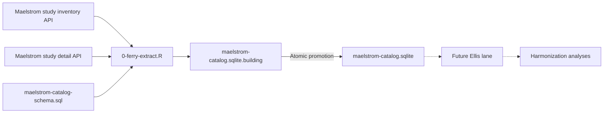

# Maelstrom Catalogue Metadata Pipeline

## Purpose

The pipeline creates a reproducible local metadata store for exploring harmonization
potential across individual studies in the Maelstrom Research catalogue. The current
implementation is a Ferry lane: it transports public API metadata into a normalized
SQLite staging database without making analytical harmonization decisions.

## Architecture



Solid arrows are implemented. Dotted arrows mark planned work.

## Current Artifacts

| Artifact | Role |
| --- | --- |
| `manipulation/0-ferry-extract.R` | Queries the public APIs and orchestrates SQLite generation |
| `manipulation/maelstrom-catalog-schema.sql` | Declares tables, keys, and indexes |
| `config.yml` | Declares the canonical SQLite output path |
| `data-private/derived/maelstrom/maelstrom-catalog.sqlite` | Current Ferry staging database |
| `manipulation/pipeline-project-spec.md` | Defines source, lane, output, and validation contracts |

## Execution

Run from the repository root:

```powershell
Rscript ./manipulation/0-ferry-extract.R
```

The script reads the target path from `config.yml`, retrieves the complete current
individual-study inventory, fetches each detail payload, applies the SQL schema to a
temporary database, and atomically replaces the canonical SQLite file after success.

The SQL schema is not a separate manual prerequisite. The Ferry lane executes it as part
of every rebuild, ensuring that code and physical database structure stay synchronized.

## Diagnostic Checkpoints

After a complete rebuild, inspect the latest run:

```sql
SELECT
  run_id,
  expected_total_studies,
  extracted_inventory_studies,
  extracted_detail_studies,
  status
FROM extraction_runs
ORDER BY started_at_utc DESC
LIMIT 1;
```

Verify one-to-one study coverage:

```sql
SELECT
  (SELECT COUNT(*) FROM study_inventory) AS inventory_studies,
  (SELECT COUNT(*) FROM study_detail_raw) AS raw_detail_studies,
  (SELECT COUNT(*) FROM studies) AS normalized_studies;
```

Inspect the main child-table volumes:

```sql
SELECT 'study_populations' AS table_name, COUNT(*) AS row_count
FROM study_populations
UNION ALL
SELECT 'data_collection_events', COUNT(*)
FROM data_collection_events
UNION ALL
SELECT 'dce_data_sources', COUNT(*)
FROM dce_data_sources
UNION ALL
SELECT 'dce_biosamples', COUNT(*)
FROM dce_biosamples;
```

## Current Baseline

The first complete extraction on 2026-07-27 produced:

| Entity | Rows |
| --- | ---: |
| Individual studies | 455 |
| Study populations | 998 |
| Data collection events | 6,482 |
| Investigator and contact memberships | 2,199 |
| Study attributes | 1,628 |
| Event data-source terms | 14,345 |
| Event biosample terms | 4,585 |

These counts are diagnostic baselines rather than permanent expectations. Changes in the
public catalogue should be preserved and investigated, not forced back to these values.

## Failure Behavior

- API or parsing failures stop the run before replacing the canonical database.
- Database construction occurs in a `.building` file.
- A successful transaction and database disconnect are required before promotion.
- A stale `.building` file is removed at the beginning of the next run.

## Next Lane

The next pipeline milestone is an Ellis lane that standardizes the Ferry metadata for
comparative analysis. Candidate outputs include study-by-domain coverage matrices,
longitudinal depth measures, geography and recruitment taxonomies, and transparent
harmonization-opportunity scores. The Ellis design and validation target remain to be
specified.
